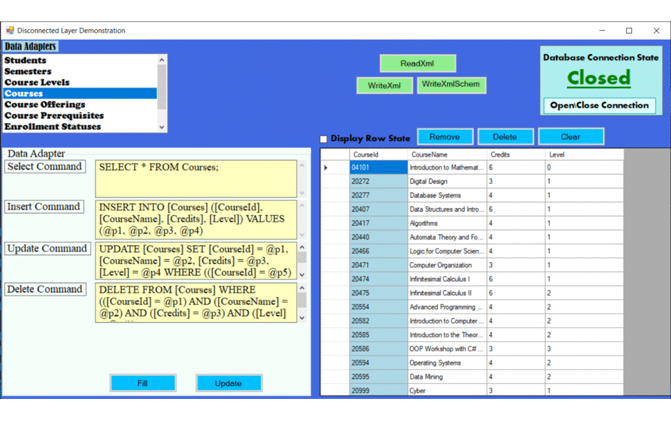
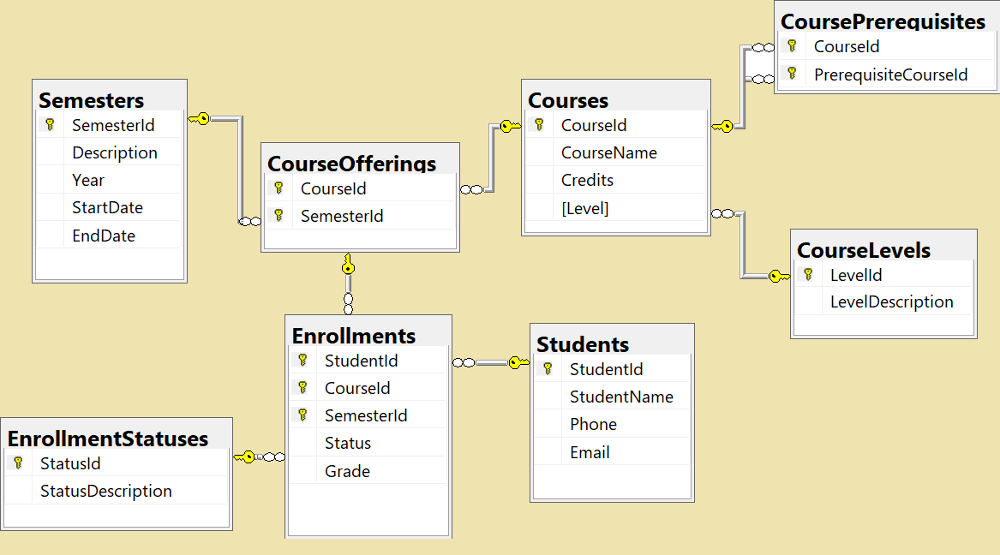

# ADO.NET-Disconnected-Layer-Demonstration :unlock:

### Miniature desktop application for demonstrating the ADO.NET disconnected layer access to databases.

## Brief Description
This application demonstrates the usage of  [data adapters](https://docs.microsoft.com/en-us/dotnet/api/system.data.common.dataadapter?view=netcore-3.1#remarks), 
[datasets](https://docs.microsoft.com/en-us/dotnet/api/system.data.dataset?view=netcore-3.1#remarks),
[data tables](https://docs.microsoft.com/en-us/dotnet/api/system.data.datatable?view=netcore-3.1#remarks)  
and the interaction between them,
while constantly displaying the 
[connection state](https://docs.microsoft.com/en-us/dotnet/api/system.data.sqlclient.sqlconnection.state?view=dotnet-plat-ext-3.1#remarks) (opened/closed),  
with an option to display the [row state](https://docs.microsoft.com/en-us/dotnet/framework/data/adonet/dataset-datatable-dataview/row-states-and-row-versions)
that is maintained by the [unit of work](https://martinfowler.com/eaaCatalog/unitOfWork.html),  
and serializing and deseriailzing the data & schema to/from XML and XSD files.

## Database diagram
The appliaction uses the following database for demonstration:

## General Background
The disconnected layer manipulates the data in-memory while keeping the connection to the database **closed**,   
and openning the connection only to sync reads/writes,  
conceptually implementing Martin Fowler's [Record set](https://martinfowler.com/eaaCatalog/recordSet.html) pattern.  
this is a similar concept to the Git & GitHub: 
- **Pull** (Clone/Fork) is similar to the data adapter's [Fill](https://docs.microsoft.com/en-us/dotnet/api/system.data.common.dataadapter.fill?view=netcore-3.1) method. 
- **Push** is similar to the data adapter's [Update](https://docs.microsoft.com/en-us/dotnet/api/system.data.common.dataadapter.update?view=netcore-3.1) method. 

